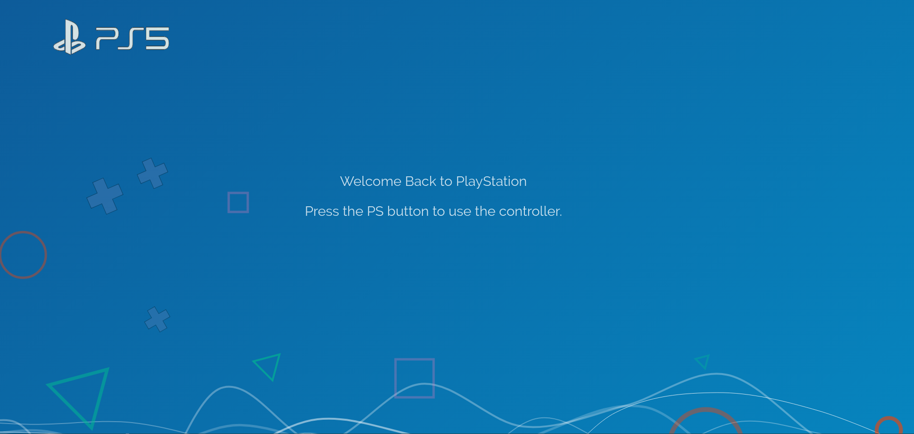

Assignment 1 - Hello World: GitHub and d3  
===
[https://mcdonoughd.github.io/01-ghd3/](https://mcdonoughd.github.io/01-ghd3/)

When one thinks of graphical primitives, it is easy to think of the basic PlayStation symbols. With this mindset I've made my own envisioning of the PlayStation 5 Launch/Start Up screen.

This site uses primitives Lines (Paths), Triangles (Polygons), Crosses (Symbols), and Circles and Rectangles (Shapes).

Screen-shots
---

For reference here is [a link to the PlayStation 4's Launch Screen](https://www.youtube.com/watch?v=3uFWnIGmiMQ)

Resources
---
-  [d3indepth](https://d3indepth.com/shapes/)
-  [dashingd3js](https://www.dashingd3js.com/svg-paths-and-d3js)
-  [dashingd3js](https://www.dashingd3js.com/svg-basic-shapes-and-d3js)
-  [gradient-animator](https://www.gradient-animator.com/)
-  [bost.ocks.org](https://bost.ocks.org/mike/path/)

---

Technical Achievement
---
 - Minified of CSS & JS
 - Calculation of an equilateral triangle from a given point and side length
 - Implementation of random data in a queue that draw the Lines and push and pop to simulate movement
 - Calculation of 2 min. animation and spacing for "seemingly random" shape spacing and time

Design Achievement
---
 - Use of Negative Space
 - Addition of calming Music (volume set very low to not startle headphone users)
 - Slow sweeping animations and cool colors to inflict a calming mood on the user
 - Scale-ability for devices above 700px in Width
 - Added favicon.ico
