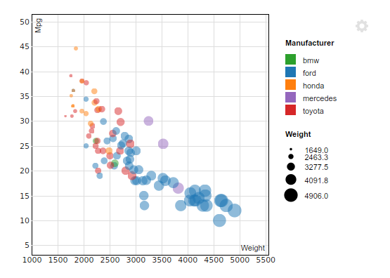
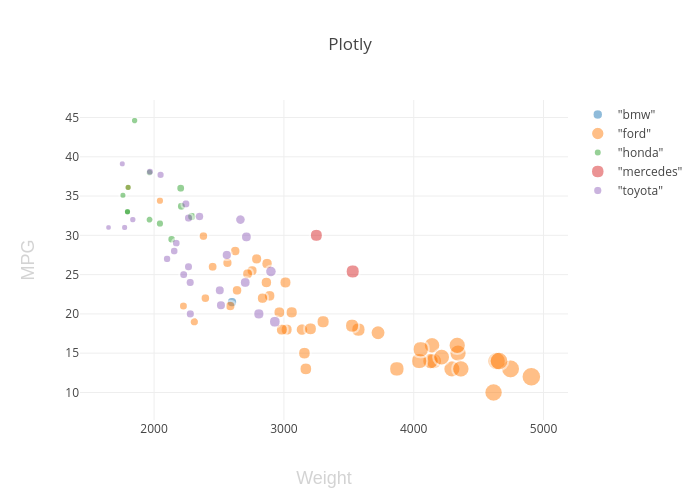
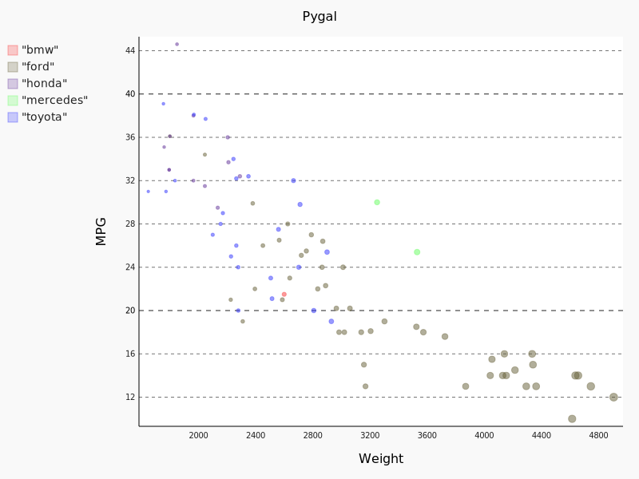

# 02-DataVis-10ways

Assignment 2 - Data Visualization, 10 Ways  
===
by Daniel McDonough (Mcdonoughd)

### How I approached this with each visualization:
- Tried to use the Library's built in CSV reader when possible
- Tried to measure time and my 'happiness' to the best of my ability to compare languages. On the basis that 'lines of code' isn't the best measurement tool for efficiency.
- Attempted Legends when possible but did not bother if I was "unhappy"

### Always attempted the following when possible:
- Data positioning: it should be a downward-trending scatterplot as shown.  Weight should be on the x-axis and MPG on the y-axis.
- Scales: Note the scales do not start at 0.
- Axis ticks and labels: both axes are labeled and there are tick marks at 10, 20, 30, etcetera.
- Color mapping to Manufacturer.
- Size mapping to Weight.
- Opacity of circles set to 0.5 or 50%.

# R + ggplot2
References: [ggplot2 Cheatsheet](https://github.com/rstudio/cheatsheets/blob/master/data-visualization-2.1.pdf)

R is a language primarily focused on statistical computing. ggplot2 is a popular library for charting in R.
As i have never touched R before, I found R studio overwhelming at first, but once I learned how to use the console and terminal to install ggplot, it was very relaxing from there.
The hardest part was figuring out how to deal with `NA` values, which ggplot took care of for me.   

Overall, I was very impressed that it took only a couple of lines of code and took about 2 hours including downloading RStudio and learning how to use it, and about 1 hour excluding.

# R + ggvis
References: [ggplot to ggvis](http://jimhester.github.io/ggplot2ToGgvis/)

If one knowns how to use ggplot2, then ggvis is will be easily picked up. Using the above guide translating ggplot code into ggvis was very simple. In fact for my implementation, it took less characters of code than my implementation of ggplot. Noteworthy things of comparison when using it are
- Cant give titles (this is a really weird this to not have but you can work around it with R Markdown)
- Does not automatically remove NA values like how ggplot does
- Only shows color legend automatically, not the size legend

Overall, I was extremely impressed by the ease of translating ggplot to ggvis as this only took about a half hour. Starting from scratch however, I would expect a similar feelings and time from ggplot.

# R + htmlWidgets + scatterD3.js
References: [scatterD3](https://juba.github.io/scatterD3/articles/introduction.html)

When searching for R graphing libraries, htmlWidgets often came up. To build scatter plots specifically, the widget scatterD3.js was used. This unique method of graphing produced interesting results. As you can see, the defaults for the axis labels, sizes, and colors feel off. The axis labels are inside the graph, the sizes scale too dramatically in comparison to some other graphing libraries. However, the final product produced is fully interactive. You can hover and drag around the graph in the viewer of RStudio. This is really powerful for the final product although the color and font choices my need to be tweaked from the default. Another notable tidbit is that the NA values were automatically removed.

Overall, scatterD3 is interactive and easy to develop in, and took about an hour to set up and produce, although one my expect to spend more time on this to make it look more visually pleasing.

# Python + MatPlotLib
References:  [Matplotlib](https://matplotlib.org/) [matplotlib_guide](https://realpython.com/python-matplotlib-guide/)

MatPlotlib(MPL) is known to be a standard when it comes to data visualizations in Python. I found it to be the most versatile, and complex library to work with. Having such a tool that is so customize able, there is a lot of basic steps and hurdles one has to go over in order to use it effectively, where other libraries do it automatically. I had to separate the dataset into manufacturer in order to display by color which required some slight computation prior using NumPy. In addition I also had to clean the data, by writing my own parser which was very tedious. MatPlotLib compiles to a pop-up that can be saved to an image. To plot the points I used MatPlotLib's `scatter` rather than `plot` which was also used in tutorials and examples found online. It was little distinctions like this that made MPL hard to use.

In the end, it took me a little over 2 agitated hours to use MatPlotLib.

# Python + Seaborn
References: [Seaborn](https://seaborn.pydata.org/)

  Based on MatPlotLib, Seaborn is an extensive Library made for the ease of displaying data. In conjunction with Pandas, Seaborn was extremely simple in comparison to MatPlotLib, where the defaults of the legend and color aspects were smartly automated and required no data pivoting or manipulation. I was able to plot the graph using about 10 lines of code. This library greatly improves upon MatPlotLib and should definitely be looked into for quick results.

  Overall, it took me a joyful half hour to use Seaborn

  

  
  

# Python + Plotly
References: [Plotly](https://plot.ly/python/)

  As an external API/library that can be used across multiple languages and environments the scalability of this method is great. However you are required to sign up for Plot.ly's program which may cost money for long time users. Beyond that, Plot.ly's method of producing visualizations via python is for customize-ability, which requires alot of time to produce and get started with connecting with the api, and continuously going to the webapp to check your updated viz (you need an internet connection to use this). Easily, the worst part about Plot.ly is the documentation. It is very disorganized and often references different languages and Libraries in examples and references.

  Overall, it me a sad 1.5 hours to produce a plot in Plot.ly

  

  
  

# Python + Pygal
References: [Pygal](http://www.pygal.org/en/stable/)

  As I was using Pygal I had to reuse alot of code from MatPlotLib to parse the data. This released a lot of stress which one may have when using Pygal from scratch. That being said, a interesting feat of Pygal is the use of CSS to style the graph. The CSS however is interesting because not all styles can be used. For example, the opacity attribute is not used, but rather I had to define a color space with their alpha being 0.5. That along with the ease of use to input data into the chart and have it be automatically formated to a pleasing.

  Overall, it was very easy to input the data and took about 1 hour to use Pygal.

  

  
  

# Python + Bokeh
References: [Bokeh](https://bokeh.pydata.org/en/latest/)

  Bokeh, is my personal favorite Python visualization tool to use in this project. It is the easiest Python graphing library to use. It automatically parses the CSV input. The hardest part was making a color map for all the categories. The best part however, is that it exports to a local html file and produces an interactive web-app ready to go. This is great for small fast interactive data applications. This amazing tool took about 30 minutes to get set up and running. I do plan to use this potentially in the future for later projects.

  Overall, very pleased with this library and the short amount of time it took to use.

  

  
  

# D3.js
References: [D3 csv](http://learnjsdata.com/read_data.html)

  D3 is the standard nowadays to data visualizations on the web. That being said, it does not need to take 2 hours to figure out how to retrieve and parse a CSV asynchronously. The largest problem was fetching only a lien at a time. As starting with any new language, I do have to write a parser for the CSV and remove any NA data sets. This made it somewhat difficult to organize by color and size. Beyond that, the final product was not interactive, however I could make it if I spent more time on it.

  In the end, it took me 2 hours after trial and error of making a parser, which the end result still needs work to become a full application.

  

  
  

# TauCharts.js
References: [TauCharts](https://api.taucharts.com/)

Taucharts.js is another js graphing library. The final result of it however is already interactive and has the the legend for both size and color. This reduces the amount of work that one has to do for D3  in comparison. However it does come at a cost for customize-ability, where you cannot scale the axis, plot different shapes, and requires parsing and cleaning prior to adding it to the graph as it does not do it automatically. That being said, the parsing and inputting data into the graph is very simple in comparison to D3 and is deficiently worth looking into in the future.

Overall, it took me 1 hour to produce an interactive graph in Taucharts.js

## Technical Achievements
- **Graphed My Happiness Overtime**:
Over the course of this project, I measured my own happiness/feelings toward the library, over a score from 1 to 10 every 10 minutes or so. Using scatterD3 in R I graphed this resulting in the trends below. This chart is interactive to in an external HTML doc `/Code/R/Library compare.html`

Upon viewing this, I can deduce a few trends:
- D3 and MatPlotLib, have the most variance in hatred
- MatPlotLib had the most hatred
- Seaborn had the best emotional response
- R overall had the best emotional responses
- Python had the greatest variance in responses
