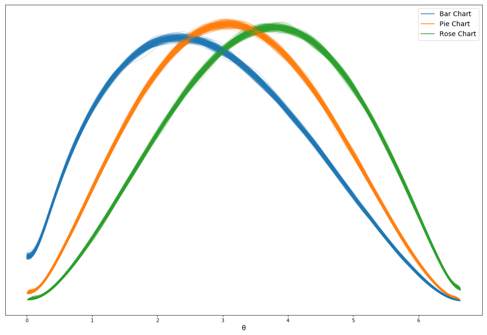

Assignment 3 - Replicating a Classic Experiment  
===
By Daniel McDonough (dmcdonough) and Nathan Dennler (nsdennler)

[https://mcdonoughd.github.io/03-Experiment/](https://mcdonoughd.github.io/03-Experiment/)

We have tested 3 charts;  
barchart (T3)   


piechart (T6)   


and a rosechart  (not included in the original experiment).   


 We hypothesised that the rosechart would result in an equal log mean error range in comparison to the piechart as it is also a angular-area typed chart. We then tested 14 students asking for their Age, Race, Sex, sexual orientation (in hopes to analyze this later, but we did not have enough time) and ordered them to determine the percentage size difference between two data points of a randomly generated graph, for 60 graphs. Totaling to 840 data points, 280 per chart type. Using PySTAN, we can take a sample and model a 95% confidence interval to estimate a global log mean error.


From our experiment, we can see that our results are slightly off from the expected results by the Cleveland study. We can see that the barchart error is not about 1.7 but about 2.5 with a much smaller error range, likewise the piechart is about 3 rather than 2. Part of this could be due to differing methodologies, or the fact that our friends tire of the experiment after the first few trials, so they become less accurate over time. The relative values did seem to be similar to the original experiment (i.e. the pie chart is worse than the bar chart by around half a point on this scale)


---

Here is the first screen to be seen by a subject, where they enter their demographic data.


Here, the red dot and bar represent the estimated global log mean error, and the gray dots are the data points of a the current subject's tests.


This is the expected results provided by the Cleveland experiment

In order to run the server locally run :
  'virtualenv env
  source env/bin/activate
  pip install -r requirements.txt
  python3 app.py
  Once STAN compiles and the server is running go to [http://127.0.0.1:5000/](http://127.0.0.1:5000/index.html)'

To run the jupyter notebook, run :
  pip install theano pymc3
  jupyter-notebook
  Then go to the specified port on your computer and open Bayesian_Tests/Bayesian Inference.ipynb
  run all of the cells in order (or you can see what the output looks like if you look below our labeled acheivements, we have included it there too)


Overall, the results were as follows:   
<div>
<table border="1" class="dataframe">
  <thead>
    <tr style="text-align: right;">
      <th></th>
      <th>mean</th>
      <th>sd</th>
      <th>mc_error</th>
      <th>hpd_2.5</th>
      <th>hpd_97.5</th>
    </tr>
  </thead>
  <tbody>
    <tr>
      <th>Bar Chart Mean</th>
      <td>2.746551</td>
      <td>0.093097</td>
      <td>0.003037</td>
      <td>2.543337</td>
      <td>2.906029</td>
    </tr>
    <tr>
      <th>Pie Chart Mean</th>
      <td>3.108021</td>
      <td>0.083472</td>
      <td>0.002498</td>
      <td>2.940582</td>
      <td>3.260388</td>
    </tr>
    <tr>
      <th>Rose Chart Mean</th>
      <td>3.525776</td>
      <td>0.079977</td>
      <td>0.002279</td>
      <td>3.36540</td>
      <td>3.678315</td>
    </tr>
  </tbody>
</table>
</div>

Because there are no overlaps in the 95% credible interval, we can say that the charts are perceptually different. The Bar chart is the easiest to read, followed by the Pie Chart, followed by the Rose Chart, which is what we expected.


Technical Achievement
---
 - Made a Python HttpServer using Flask (we could not find reliable free hosting for Flask that also had enough space to download and use Stan (~50MB))
 - 95% Bootstrapping done in PySTAN
 - Estimated distribution of responses by graph type estimated with PyMC3
 - Testing of edge cases on the form, and using flex containers for size support

Design Achievement
---
 - Courier font chosen to reduce dyslexia when reading (choice based on this [study](https://www.researchgate.net/publication/262320823_Good_fonts_for_dyslexia))
 - Styling of the Starting Form based on [this](https://uxplanet.org/designing-more-efficient-forms-structure-inputs-labels-and-actions-e3a47007114f)
 - Ease of Life Features (Tabbing on the form, auto focus on input area)
 - Final Chart is interactive if you have over points it shows a tool tip
 - Charts styled to match eachother (transparent with black outline, and black dots to indicate comparisons)
 - "Popup" animations for the testing charts to hint at how the chart should be measured


***Jupyter Notebook Output***
## Bayesian Inference for the Experimental Results of Perceptual Study ##

This Jupyter Notebook serves to show the process by which we performed the Bayesian analysis of the data. We will be using PyMC3 to build probabilistic models.

Resources consulted to learn more about Bayesian Inference in general, as well as how to use PyMC (a Markov Chain Monte Carlo Library):  
https://docs.pymc.io/  
https://www.analyticsvidhya.com/blog/2016/06/bayesian-statistics-beginners-simple-english/  
https://www.youtube.com/watch?v=p1IB4zWq9C8&index=5&list=PL1Ma_1DBbE82OVW8Fz_6Ts1oOeyOAiovy  
https://docs.pymc.io/notebooks/Bayes_factor.html  

First, we will import the required libraries:


```python
import pandas as pd
import math
import matplotlib.pyplot as plt
import numpy as np
import theano.tensor as tt
import pymc3 as pm

print('Done.')

from scipy.special import betaln
import scipy.stats as ss
```

Now, we will read in the data.

To get an idea of the shape, we will visualize some histograms to see how the data are distributed.


```python
# let's load the data, and for the overall analysis, split it into one array of errors per chart type.
# we will also normalize the values to be on the range of 0 to 1 to get some


data = pd.read_csv('../subjectdata/master.csv')

barData = data[data['chartType']=='barChart']['error']/6.646
pieData = data[data['chartType']=='pieChart']['error']/6.646
roseData = data[data['chartType']=='roseChart']['error']/6.646

allData = np.array([barData.values, pieData.values, roseData.values])
```


```python
#print out the histogram of the data

plt.hist(barData.values)
plt.title('Bar Chart Histogram')
plt.xlabel('Normalized Error')
plt.ylabel('Number of Occurances')
plt.show()

plt.hist(pieData)
plt.title('Pie Chart Histogram')
plt.xlabel('Normalized Error')
plt.ylabel('Number of Occurances')
plt.show()

plt.hist(roseData)
plt.title('Rose Chart Histogram')
plt.xlabel('Normalized Error')
plt.ylabel('Number of Occurances')
plt.show()
```


Yikes, so it seems like some way we structured our experiment caused some weird data points where people can exactly guess the relative sizes very often.

to try to clean this, we will exlude data that corresponds to very small errors.


```python
barDataFiltered = barData[barData > .03]
pieDataFiltered = pieData[pieData > .03]
roseDataFiltered = roseData[roseData > .03]

allData = np.array([barDataFiltered.values, pieDataFiltered.values, roseDataFiltered.values])

print(len(barDataFiltered),len(pieDataFiltered),len(roseDataFiltered))

plt.hist(barDataFiltered)
plt.title('Bar Chart Histogram')
plt.xlabel('Normalized Error')
plt.ylabel('Number of Occurances')
plt.show()

plt.hist(pieDataFiltered)
plt.title('Pie Chart Histogram')
plt.xlabel('Normalized Error')
plt.ylabel('Number of Occurances')
plt.show()

plt.hist(roseDataFiltered)
plt.title('Rose Chart Histogram')
plt.xlabel('Normalized Error')
plt.ylabel('Number of Occurances')
plt.show()
```

    (216, 240, 254)


Next, we will set up the model to learn the parameters for the distribution our data follow.

We chose to model the distribution of error in guessing relative percentages as a beta distribution, for the following observations about our data:

1. The values that the data can take are continuous.
The input can be any number from 0-100, the actual value to be guessed can be any rational number from 0-100, and the error is calculated with a log, so the output is in the domain of real numbers.

2. The data are bounded from log2(0.125) to log2(100.125).
Therefore we can rule out distributions that aren't bounded on both sides, because associating any non-zero probability to anything outside this range would not correctly model the data.

3. The distribution may not be symetrical about its mean.
There is likely to be some skew in the data which is typical of bounded data, especially when the mean is close to one of the endpoints. In these cases, the data are usually skewed away from the endpoints.

The beta distribution has an additional perk of a simple calculation for its mean [mean = a/(a+b)]

To be conservative, we consider a uniform distribution over the range of [1,100] to model the possible values of alpha and beta, since we do not want to introduce biases. The distribution for both alpha and beta are updated as samples are drawn from the data.

We also set up a deterministic variable that allows us to calculate the mean, and propagate the error from alpha and beta.


```python
n_chains = 1000

models = []
traces = []
for chartTypeData in allData:
    with pm.Model() as model:
        #first we will set up the
        a = pm.Uniform('alpha parameter', 1, 100)
        b = pm.Uniform('beta parameter', 1, 100)

        mean = pm.Deterministic('mean', a/(a+b))


        yl = pm.Beta('yl', a, b, observed=chartTypeData)
        trace = pm.sample(1000,
                          step=pm.SMC(),
                          random_seed=42)
        models.append(model)
        traces.append(trace)
```


```python
pm.traceplot(traces[0])
pm.summary(traces[0])
```


<div>
<style scoped>
    .dataframe tbody tr th:only-of-type {
        vertical-align: middle;
    }

    .dataframe tbody tr th {
        vertical-align: top;
    }

    .dataframe thead th {
        text-align: right;
    }
</style>
<table border="1" class="dataframe">
  <thead>
    <tr style="text-align: right;">
      <th></th>
      <th>mean</th>
      <th>sd</th>
      <th>mc_error</th>
      <th>hpd_2.5</th>
      <th>hpd_97.5</th>
    </tr>
  </thead>
  <tbody>
    <tr>
      <th>alpha parameter</th>
      <td>1.941409</td>
      <td>0.170802</td>
      <td>0.004929</td>
      <td>1.602935</td>
      <td>2.264473</td>
    </tr>
    <tr>
      <th>beta parameter</th>
      <td>2.757763</td>
      <td>0.249652</td>
      <td>0.007693</td>
      <td>2.312074</td>
      <td>3.273334</td>
    </tr>
    <tr>
      <th>mean</th>
      <td>0.413265</td>
      <td>0.014008</td>
      <td>0.000457</td>
      <td>0.382687</td>
      <td>0.437260</td>
    </tr>
    <tr>
      <th>mean (denormalized)</th>
      <td>2.746551</td>
      <td>0.093097</td>
      <td>0.003037</td>
      <td>2.543337</td>
      <td>2.906029</td>
    </tr>
  </tbody>
</table>
</div>


```python
pm.traceplot(traces[1])
pm.summary(traces[1])
```


<div>
<style scoped>
    .dataframe tbody tr th:only-of-type {
        vertical-align: middle;
    }

    .dataframe tbody tr th {
        vertical-align: top;
    }

    .dataframe thead th {
        text-align: right;
    }
</style>
<table border="1" class="dataframe">
  <thead>
    <tr style="text-align: right;">
      <th></th>
      <th>mean</th>
      <th>sd</th>
      <th>mc_error</th>
      <th>hpd_2.5</th>
      <th>hpd_97.5</th>
    </tr>
  </thead>
  <tbody>
    <tr>
      <th>alpha parameter</th>
      <td>2.523879</td>
      <td>0.217667</td>
      <td>0.006220</td>
      <td>2.145418</td>
      <td>2.957026</td>
    </tr>
    <tr>
      <th>beta parameter</th>
      <td>2.874068</td>
      <td>0.257036</td>
      <td>0.007584</td>
      <td>2.404217</td>
      <td>3.391922</td>
    </tr>
    <tr>
      <th>mean</th>
      <td>0.467653</td>
      <td>0.012560</td>
      <td>0.000376</td>
      <td>0.442459</td>
      <td>0.490579</td>
    </tr>
    <tr>
      <th>mean (denormalized) </th>
      <td>3.108021</td>
      <td>0.083472</td>
      <td>0.002498</td>
      <td>2.940582</td>
      <td>3.260388</td>


    </tr>
  </tbody>
</table>
</div>


```python
pm.traceplot(traces[2])
pm.summary(traces[2])
```


<div>
<style scoped>
    .dataframe tbody tr th:only-of-type {
        vertical-align: middle;
    }

    .dataframe tbody tr th {
        vertical-align: top;
    }

    .dataframe thead th {
        text-align: right;
    }
</style>
<table border="1" class="dataframe">
  <thead>
    <tr style="text-align: right;">
      <th></th>
      <th>mean</th>
      <th>sd</th>
      <th>mc_error</th>
      <th>hpd_2.5</th>
      <th>hpd_97.5</th>
    </tr>
  </thead>
  <tbody>
    <tr>
      <th>alpha parameter</th>
      <td>2.723842</td>
      <td>0.238843</td>
      <td>0.007216</td>
      <td>2.257819</td>
      <td>3.174338</td>
    </tr>
    <tr>
      <th>beta parameter</th>
      <td>2.410351</td>
      <td>0.211257</td>
      <td>0.006335</td>
      <td>1.956401</td>
      <td>2.797891</td>
    </tr>
    <tr>
      <th>mean</th>
      <td>3.525776</td>
      <td>0.079977</td>
      <td>0.002279</td>
      <td>3.36540</td>
      <td>3.678315</td>
    </tr>
  </tbody>
</table>
</div>


```python
ppc_0 = pm.sample_posterior_predictive(traces[0], 100, models[0], size=(50, 20)) #size samples 50 points from 20 distributions (parameters are in that order)
ppc_1 = pm.sample_posterior_predictive(traces[1], 100, models[1], size=(50, 20))
ppc_2 = pm.sample_posterior_predictive(traces[2], 100, models[2], size=(50, 20))
```


```python
_, ax = plt.subplots(figsize=(18, 12))

for m_0, m_1, m_2 in zip(ppc_0['yl'].T, ppc_1['yl'].T, ppc_2['yl'].T):
    pm.kdeplot(m_0 * 6.646, ax=ax, alpha=0.2, color='C0') # return back to the scale we used before normalization
    pm.kdeplot(m_1 * 6.646, ax=ax, alpha=0.2, color='C1')
    pm.kdeplot(m_2 * 6.646, ax=ax, alpha=0.2, color='C2')

ax.plot([], label='Bar Chart')
ax.plot([], label='Pie Chart')
ax.plot([], label='Rose Chart')
ax.legend(fontsize=14)
ax.set_xlabel(u'θ', fontsize=14)
ax.set_yticks([]);
```





```python

```
