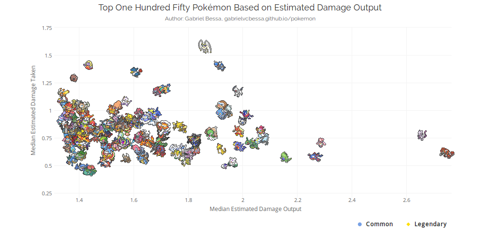
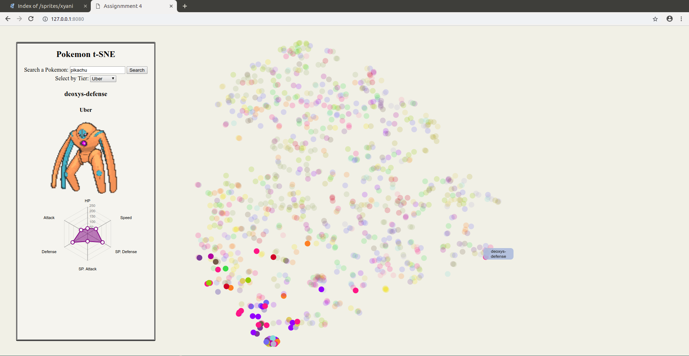

Assignment 4 - ~~Visualizations and Multiple Views~~ DataVis Remix!  
===

[Original: Visualize information on all 802 Pokemon](https://gabrielvcbessa.github.io/pokemon/)

### Critique (bottom two plots)

Reading the rational behind the creators use of estimated damage input / output to determine the best pokemon seems good in theory. However, when viewed from a domain prospective it completely ignores the most important parts of pokemon: the speed and health stats. For example if a Mon, goes first it is more likely to kill the opponent before it can even strike (IE Pheromosa). These play a vital part in determining the role of the Mon whether it be sweeper, wall, lead, tank, pivot, ect. (although many pokemon fit many roles). In terms of a competitive analysis of a pokemon's role in the game, this is only really useful for looking at outliers in walls, tank or sweepers, Mons (IE Groudon).

### Redesign

In order to redesign the algorithm used to calculate the usefulness of a pokemon, I decided to use t-SNE on the 6 stats (HP, Attack, Defense,SP. Attack, SP. Defense, Speed) and reduce the dimensionality to 2 dimensions to plot it on a plane. Using this method we are not only comparing the base state total of all the pokemon, but also their "roles" based on the cluster of known similar roles.The user can input the epsilon (learning rate), perplexity (neighbor influence) and number of iterations to run t-SNE for. The user can hover over a data point to see the name of the pokemon corresponding to that point. If they cannot find what they are looking for they can search for a pokemon in the search bar. In addition, I added a tier list data entry (which are determined by global usage) to the dataset, to be able to analyze any trends of overall stats compared to how often people actually use a certain pokemon. Datapoints are no longer colored to legendary to non legendary but rather the pokemon's primary type. When a datapoint is selected, an image of the pokemon appears (if the database used has a corresponding image) along with a radar char of the pokemon's stats.

### Noticeable Trends

In the visualization you can see a general trend of pokemon in the LC (little cup) tier being in one corner because all their stats are very low, and Uber being in the other corner because they generally have high base stats, this trend goes for all the tiers. On a more interesting note, clusters formed by t-SNE by nature form clusters on similarity. Pokemon with similar stat distribution tend to fit similar roles, so clusters approximately label neighbors to fit similar roles even if you don't expect then to. For example, Blissey (known for its insane HP stat) has similar roles (stall) to Guzzlord, and Alomomola who are often nearby. Like-wise Hooh and its neighbors share similar roles (Special Walls), and Shuckle's neighbors for their roles as Mixed walls and often Stall in the game. The best conclusion to come from this however is that, Type and Moveset and Items really do play a role in the pokemon's usage. For example, Cloyster is near all the physical walls, but in game is used a sweeper due to its frail typing (water/ice is a bad combo to have as a physical wall) and the fact that it gets "Shell Smash" which doubles its Speed, Attack and Special Attack, and when holding the "white herb" has no drawbacks. In the future it would be interesting to pivot the data to Mon's who use "gimmick moves" like "shell smash" or "trick room" and see where they lie on the spectrum.

##Technical Achievements
  - Use of t-SNE algorithm of 6D data to reduce to 2D

##Design Achievements
  - Use of Search feature
  - Use of Tier Pivoting
  - Use of Radar Chart of stats when a data point is hovered (good for general comparisons overall features)
  - Zoom & Pan
